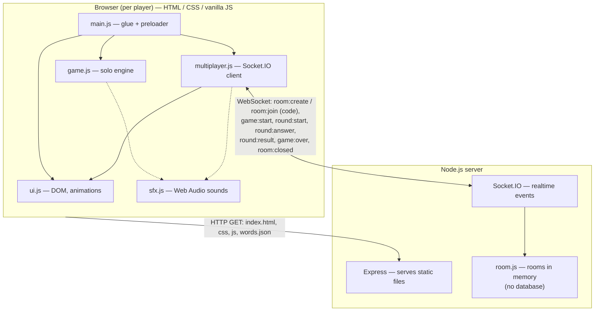
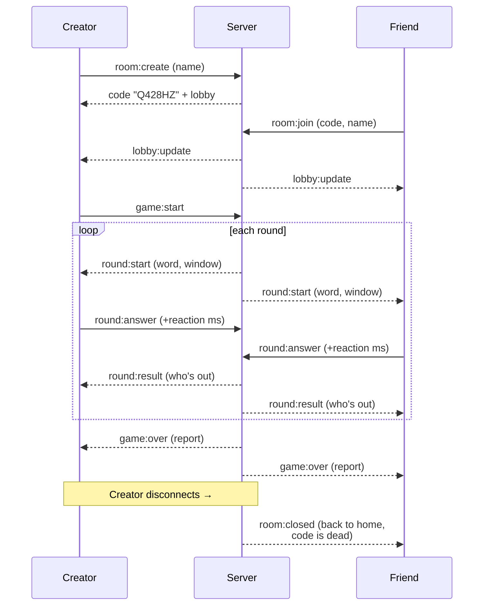

# 🪽 Flyer — Chidiya Udd

A digital version of the Indian playground game **Chidiya Udd** ("bird,
fly!"). A word pops up. If the thing can fly, press **FLY**. If it can't,
press **SIT**. The answer window keeps shrinking, and one mistake (or one
timeout) knocks you out.

Play **solo**, or **with friends**: one player creates a room and gets a
6-character room code, up to 5 players join with that code, everyone sees
the same words at the same moment, and the last player standing wins.

## Running it

### Full version (solo + multiplayer)

Needs Node.js 18+.

```bash
npm install
npm start
# open http://localhost:8642   (change port with: PORT=xxxx npm start)
```

### Solo only

Any static file server works (multiplayer will show a "server not
reachable" message):

```bash
python3 -m http.server 8000
```

## How to play

| Action | Button | Keyboard |
| ------ | ------ | -------- |
| It flies | FLY | `↑` or `W` |
| It doesn't | SIT | `↓` or `S` |
| Start / restart (solo) | Play | `Space` / `Enter` |
| Mute | 🔊 in navbar | — |

**Solo:** sudden death. Score = words survived + average/fastest reaction
time. Best score is saved in the browser (localStorage). From the game-over
screen you can play again or go back to the home screen.

**Multiplayer:** Play with Friends → enter your name → *Create a room* (you
get a code like `Q428HZ`) or *join with a code*. The creator starts the
game. Wrong or late answers eliminate you (your name turns red in the strip
at the top; survivors stay green and show their reaction time each round).
Eliminated players spectate. At the end, a report shows everyone's correct
answers, average and fastest reaction times, and who won.

**Room lifecycle:** a room lives only while its creator is in it. If the
creator leaves — lobby or mid-game — the room is destroyed, its code stops
working, and every remaining player is notified and sent back home.

## Where everything lives (code map)

| File | Controls |
| ---- | -------- |
| `index.html` | Page structure: preloader, navbar, sky/ground stage, FLY & SIT buttons (the fly-bird icon SVG is inline here), timer bar, all overlay screens. |
| `css/style.css` | All looks: preloader animation keyframes, sky/clouds/ground, button colors + hover/press states, player strip, lobby, report table. |
| `words.json` | **The words.** Two lists: `"fly"` and `"ground"`. Edit this file to change the words — no code needed. Used by both solo and multiplayer. |
| `js/words.js` | Fetches and validates `words.json` for the browser. |
| `js/game.js` | Solo game engine (no DOM). Timing knobs in `CONFIG` at the top: `startWindowMs`, `shrinkPerWordMs`, `minWindowMs`. |
| `js/ui.js` | Everything on screen: word animations, timer bar, flashes, particles, name/lobby/report screens, player strip. |
| `js/sfx.js` | All sounds, synthesized with Web Audio (no audio files). The soft correct-FLY chime is `correctFly()`; other effects are next to it. |
| `js/main.js` | Startup + glue: preloader timing (`PRELOADER_MIN_ITERATIONS`), input wiring, solo flow, high score, Back-to-Home. |
| `js/multiplayer.js` | Multiplayer client: create/join screens, sends answers with locally measured reaction time, reacts to server events (`round:start`, `round:result`, `game:over`, `room:closed`). |
| `server/index.js` | The Node server: serves the site over HTTP, generates 6-char room codes, routes Socket.IO events to rooms, destroys a room when its creator disconnects. |
| `server/room.js` | All multiplayer game rules: rounds, judging, elimination, the final report. Knobs in `GAME_CONFIG` at the top — including `maxPlayers: 5` (change this one number to allow bigger rooms). |
| `server/words.js` | Server-side loader for the same `words.json`. |

Naming note: the SIT button is still called `ground` inside the code
(`ground-btn`, action `'ground'`) — only the visible label changed.

### Preloader behavior

The loading screen (bird flies up, elephant sits down — a hint of the game
itself) loops every **2.5 s**. It stays until the page has fully loaded
**and** at least **2 loops** have played, then fades out at a loop boundary.
Change `PRELOADER_MIN_ITERATIONS` / `PRELOADER_ITERATION_MS` in `js/main.js`
(keep the latter in sync with the CSS animation durations).

### How a multiplayer round works

1. Server broadcasts `round:start` (word + answer window) to the whole room.
2. Each client measures reaction time locally (word shown → button press)
   and sends `round:answer`. Network lag never hurts a player because of
   this — the server just waits `graceMs` extra before judging.
3. Server judges everyone, eliminates the wrong/late, broadcasts
   `round:result`, and either starts the next round or ends the game.

## System design





**Tech per layer:** frontend is plain HTML/CSS/JS (ES modules, no
framework, no build step); backend is Node.js + Express (static files) +
Socket.IO (rooms & rounds); state is in server memory only — no database.
Deployed as one Render Web Service (`render.yaml`).

## Roadmap

- [ ] Reconnect/rejoin mid-game (currently a disconnect = elimination)
- [ ] Tricky mode (penguin, ostrich, Superman…)
- [ ] Hindi / Hinglish word packs
