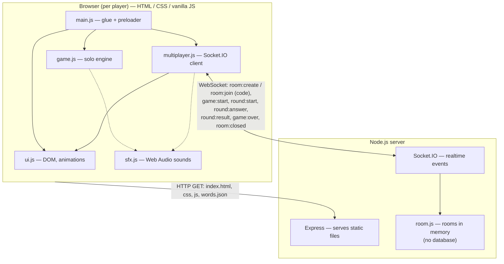
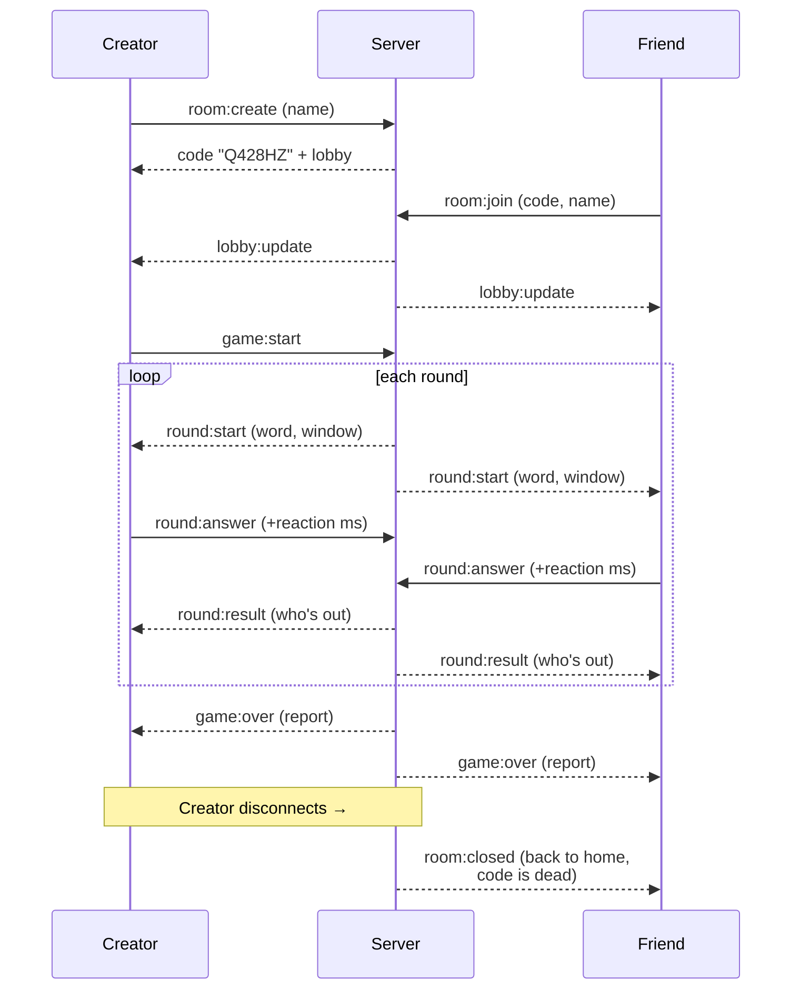

# 🪽 Flyer — Chidiya Udd

A digital version of the Indian playground game **Chidiya Udd** ("bird,
fly!"). A word pops up. If the thing can fly, press **FLY**. If it can't,
press **SIT**. The answer window keeps shrinking, and one mistake (or one
timeout) knocks you out.

Play **solo**, or **with friends**: one player creates a room and gets a
6-character room code, up to 5 players join with that code, everyone sees
the same words at the same moment, and the last player standing wins.

## Running it

### Full version (solo + multiplayer)

Needs Node.js 18+.

```bash
npm install
npm start
# open http://localhost:8642   (change port with: PORT=xxxx npm start)
```

### Solo only

Any static file server works (multiplayer will show a "server not
reachable" message):

```bash
python3 -m http.server 8000
```

## How to play

| Action | Button | Keyboard |
| ------ | ------ | -------- |
| It flies | FLY | `↑` or `W` |
| It doesn't | SIT | `↓` or `S` |
| Start / restart (solo) | Play | `Space` / `Enter` |
| Mute | 🔊 in navbar | — |

**Lives:** you get **3 lives** (three hearts in the navbar). A wrong or late
answer costs one life and buzzes the phone (`navigator.vibrate`); the game
ends on the third mistake. Applies to both solo and multiplayer.

**Game-over pictures:** when you lose, **every** word that cost you a life
(up to 3) is shown as a card. Each card cross-fades back and forth (~1s
each) between a cartoon emoji and a real photo (fetched from Wikipedia),
with a short explainer — e.g. "A camel can't fly." This is the moment to
learn what each one looks like. Fictional characters show only the emoji
(no copyrighted photo).

**Solo:** last as long as you can. Score = words survived + average/fastest
reaction time. Best score is saved in the browser (localStorage). From the
game-over screen you can play again or go back to the home screen.

**Multiplayer:** Play with Friends → enter your name → *Create a room* (you
get a code like `Q428HZ`) or *join with a code*. The creator starts the
game. Each player has 3 lives; the player strip at the top shows everyone's
remaining hearts, and a name turns red when that player is out. Survivors
show their reaction time each round; eliminated players spectate. At the
end, a report shows everyone's stats, who won, and — for players who lost —
photo cards of every word that knocked them out.

**Room lifecycle:** a room lives only while its creator is in it. If the
creator leaves — lobby or mid-game — the room is destroyed, its code stops
working, and every remaining player is notified and sent back home.

## Where everything lives (code map)

| File | Controls |
| ---- | -------- |
| `index.html` | Page structure: preloader, navbar, sky/ground stage, FLY & SIT buttons (the fly-bird icon SVG is inline here), timer bar, all overlay screens. |
| `css/style.css` | All looks: preloader animation keyframes, sky/clouds/ground, button colors + hover/press states, player strip, lobby, report table. |
| `words.json` | **The words.** Two lists: `"fly"` and `"ground"` (86 each). Edit this file to change the words — no code needed. A few very popular characters are mixed in (Superman flies, Pikachu doesn't). Used by both solo and multiplayer. |
| `js/words.js` | Fetches and validates `words.json` for the browser. |
| `js/reveal.js` | The game-over pictures. Maps a word to a Wikipedia photo (title overrides for tricky ones) + emoji + short caption ("A camel can't fly."). Characters are emoji-only (no copyrighted stills). Photos cached in localStorage. The cards' emoji↔photo oscillation is driven in `js/ui.js` (`renderReveals`). |
| `js/game.js` | Solo game engine (no DOM). Knobs in `CONFIG` at the top: `startWindowMs`, `shrinkPerWordMs`, `minWindowMs`, `lives`. |
| `js/ui.js` | Everything on screen: word animations, timer bar, flashes, particles, name/lobby/report screens, player strip. |
| `js/sfx.js` | All sounds, synthesized with Web Audio (no audio files). The soft correct-FLY chime is `correctFly()`; other effects are next to it. |
| `js/main.js` | Startup + glue: preloader timing (`PRELOADER_MIN_ITERATIONS`), input wiring, solo flow, high score, Back-to-Home. |
| `js/multiplayer.js` | Multiplayer client: create/join screens, sends answers with locally measured reaction time, reacts to server events (`round:start`, `round:result`, `game:over`, `room:closed`). |
| `server/index.js` | The Node server: serves the site over HTTP, generates 6-char room codes, routes Socket.IO events to rooms, destroys a room when its creator disconnects. |
| `server/room.js` | All multiplayer game rules: rounds, judging, lives, elimination, the final report. Knobs in `GAME_CONFIG` at the top — including `maxPlayers: 5` and `startingLives: 3`. |
| `server/words.js` | Server-side loader for the same `words.json`. |
| `js/auth.js` | Accounts + data, via Supabase: Google sign-in, save each game, record tricky words, read leaderboards, compute stats, submit feedback. All optional — guests skip it entirely. |
| `js/rating.js` | The Flyer Rating formula (accuracy/speed/depth over last 20 games, + crown bonus) and tiers. Kept in sync with the `player_ratings` view in schema.sql. |
| `js/account.js` | The **only** path that records a finished game (solo and group) and caches the player's stats/rating. Emits on change so the navbar always follows. |
| `config/supabase.js` | Your Supabase project URL + publishable key (safe in the browser). Copy from `supabase.example.js`. |
| `supabase/schema.sql` | The whole database (see "Accounts & leaderboard" and "Admin"). Run once in the Supabase SQL editor. |
| `supabase/seed_words.sql` | Seeds the `words` table from `words.json`. Run once after schema.sql. |
| `js/lib/supabase.js` | Vendored Supabase JS client (no external CDN at runtime). |
| `admin.html` + `js/admin.js` + `css/admin.css` | The admin dashboard (players, aggregates, feedback, words CRUD). Gated by an email allow-list. |
| `words.json` | Now only a **fallback/seed**. At runtime the game reads words from the Supabase `words` table (see "Words in the database"). |

## Accounts & leaderboard (optional)

Sign-in is **Google-only** and **optional** — guests play everything with
nothing saved. Signing in lets a player save every game, get a **rating**,
and appear on the leaderboards. Scores live in **Supabase** (Postgres +
Auth); the realtime multiplayer server is unchanged.

**What a signed-in player gets:**
- **Rating** (see below) shown as a chip in the navbar (tap it for the
  profile) and on the leaderboard.
- **Profile / stats** (tap your name or the rating chip): best run, games
  played, **average** and fastest reaction, day streak, rank, and your
  **most-recent tricky words** (the ~7 latest words you missed).
- **Best score follows the account**, loaded from the server — the same on
  every device, not this browser's localStorage (guests still use local).
- A rank + "top X%" line on the game-over screen, with a sign-in nudge for
  guests.
- A **⭐ + comment feedback** prompt (Feedback button on the home screen).

**Player Rating (skill, not volume).** A single 0–3000 number over each
player's **last 20 games**, so grinding many games can't inflate it:

```
accuracy   = correct / (correct + mistakes)      weight 0.45
speed      = clamp((700 - avgMs) / 450, 0..1)      weight 0.35   (250ms→best)
depth      = clamp(bestWords / 35, 0..1)           weight 0.20
base       = 3000 * weighted sum
crownBonus = min(300, 30 * crowns)                 (+30 per group-game win)
rating     = min(3000, base + crownBonus)
```

**Crowns 👑 = group games won.** Counted over *all* games (a win is a
lasting achievement, not recent form), each worth **+30 rating, capped at
+300** — so winning a group game moves the rating far more than a solo run,
which only nudges a 20-game average.

Tiers: Bronze / Silver / Gold / Platinum / Diamond; "provisional" under 5
games. The **leaderboard's main board ranks by rating** (tabs: Rating /
This Week / Fastest). The formula lives in BOTH `js/rating.js` (the
player's own live rating) and the `player_ratings` view in `schema.sql`
(everyone's, for the leaderboard) — **keep them in sync**.

**Group games count exactly like solo games** — same stats, same average
reaction time, same rating — plus a Crown on a win. Both modes record
through `js/account.js`, deliberately the *only* path that saves a game, so
a mode can't silently skip the stats/navbar refresh (an earlier bug: only
solo refreshed, so group play appeared to do nothing).

**After a game we show the rating CHANGE, not a rank** ("Rating 1512 ▲ +26").
A leaderboard rank barely moves and tells the player nothing about their own
progress; the delta does.

**Data protection:** Row-Level Security means a user can only read/write
their own rows; leaderboards are public views exposing only name + avatar +
score/rating (never email/phone). Impossible reaction times (<120 ms) are
rejected by database CHECK constraints.

## Words in the database

Words live in a Supabase `words` table so they can be edited from the admin
dashboard without code changes. Both the browser (`js/words.js`) and the
multiplayer server (`server/words.js`) read that table, with a 6-second
timeout, and fall back to the bundled `words.json` if the DB is
unconfigured, empty, unreachable, or slow. The server re-reads the table
every 5 minutes, so admin edits reach new games without a restart.

⚠️ **The table wins whenever it has any rows.** If it holds 20 words, the
game uses those 20 — `words.json` (232 words) is a fallback, not a merge.
After changing `words.json`, re-run `supabase/seed_words.sql` to push the
new words into the table (`ON CONFLICT DO NOTHING`, so it only adds what's
missing and never touches words you edited in the admin).

## Admin dashboard (`/admin.html`)

One person — identified by their Google email in the `admins` table — can
open `/admin.html`. Access is enforced by the `is_admin()` database
function and RLS (a non-admin gets no data even if they load the page).
Tabs:
- **Players** — everyone onboarded, their games played, best, join/last-played dates.
- **Aggregates** — total players/games, avg accuracy, and a reaction-time distribution chart.
- **Feedback** — every ⭐ rating + comment players have left.
- **Words** — add (`Add word`), move between the fly/sit lists (`⇄`), and delete (`×`) — full CRUD on the `words` table.

The admin signs in with the same Google button; since the session is shared
across the same origin, signing in on the main site also unlocks
`/admin.html`.

**Setup (one-time):**
1. Create a free Supabase project; run `supabase/schema.sql`, then
   `supabase/seed_words.sql`.
2. In `schema.sql`, set the admin email (the `insert into public.admins`
   line) to your Google account before running.
3. Enable the Google provider (Supabase → Auth → Providers) with a Google
   Cloud OAuth client; add your site URL(s) under Auth → URL Configuration
   (include `/admin.html` or a `/**` wildcard so admin sign-in can redirect).
4. Put your project URL + publishable key in `config/supabase.js`.

If `config/supabase.js` is blank, the game runs guest-only from
`words.json` and the account/admin features are simply inert.

Naming note: the SIT button is still called `ground` inside the code
(`ground-btn`, action `'ground'`) — only the visible label changed.

### Preloader behavior

The loading screen (bird flies up, elephant sits down — a hint of the game
itself) loops every **2.5 s**. It stays until the page has fully loaded
**and** at least **2 loops** have played, then fades out at a loop boundary.
Change `PRELOADER_MIN_ITERATIONS` / `PRELOADER_ITERATION_MS` in `js/main.js`
(keep the latter in sync with the CSS animation durations).

### How a multiplayer round works

1. Server broadcasts `round:start` (word + answer window) to the whole room.
2. Each client measures reaction time locally (word shown → button press)
   and sends `round:answer`. Network lag never hurts a player because of
   this — the server just waits `graceMs` extra before judging.
3. Server judges everyone, eliminates the wrong/late, broadcasts
   `round:result`, and either starts the next round or ends the game.

## System design


```mermaid
flowchart TB
    subgraph Browser["Browser (per player) — HTML / CSS / vanilla JS"]
        UI["ui.js — DOM, animations"]
        SFX["sfx.js — Web Audio sounds"]
        SOLO["game.js — solo engine"]
        MP["multiplayer.js — Socket.IO client"]
        MAIN["main.js — glue + preloader"]
        MAIN --> UI
        MAIN --> SOLO
        MAIN --> MP
        MP --> UI
        SOLO -.-> SFX
        MP -.-> SFX
    end

    subgraph Server["Node.js server"]
        EXPRESS["Express — serves static files"]
        IO["Socket.IO — realtime events"]
        ROOMS["room.js — rooms in memory<br/>(no database)"]
        IO --> ROOMS
    end

    Browser -- "HTTP GET: index.html, css, js, words.json" --> EXPRESS
    MP <-- "WebSocket: room:create / room:join (code),<br/>game:start, round:start, round:answer,<br/>round:result, game:over, room:closed" --> IO
```


```mermaid
sequenceDiagram
    participant C as Creator
    participant S as Server
    participant F as Friend
    C->>S: room:create (name)
    S-->>C: code "Q428HZ" + lobby
    F->>S: room:join (code, name)
    S-->>C: lobby:update
    S-->>F: lobby:update
    C->>S: game:start
    loop each round
        S-->>C: round:start (word, window)
        S-->>F: round:start (word, window)
        C->>S: round:answer (+reaction ms)
        F->>S: round:answer (+reaction ms)
        S-->>C: round:result (who's out)
        S-->>F: round:result (who's out)
    end
    S-->>C: game:over (report)
    S-->>F: game:over (report)
    Note over C,S: Creator disconnects →
    S-->>F: room:closed (back to home,<br/>code is dead)
```

**Tech per layer:** frontend is plain HTML/CSS/JS (ES modules, no
framework, no build step); the game/multiplayer backend is Node.js +
Express + Socket.IO (rooms live in server memory); accounts, ratings,
leaderboards, words, and feedback live in **Supabase** (Postgres + Auth +
RLS). Deployed as one Render Web Service (`render.yaml`).

## Roadmap

- [x] Accounts (Google sign-in) + leaderboards (Supabase)
- [x] Player Rating (skill-based) + tiers, navbar chip, profile stats
- [x] Admin dashboard (players, aggregates, feedback, words CRUD)
- [x] Words in the database (editable from admin, no code changes)
- [x] Player feedback (⭐ + comment)
- [x] Crowns 👑 (group games won) + a bigger rating boost for winning
- [x] Rating change (▲/▼) after every game instead of a rank
- [ ] Friends / private-group leaderboards
- [ ] Profile progress graph + achievements/badges
- [ ] "Practice your tricky words" mode
- [ ] Phone OTP sign-in (needs an SMS provider + India DLT)
- [ ] Reconnect/rejoin mid-game (currently a disconnect = elimination)
- [ ] Tricky mode (penguin, ostrich, Superman…)
- [ ] Hindi / Hinglish word packs
